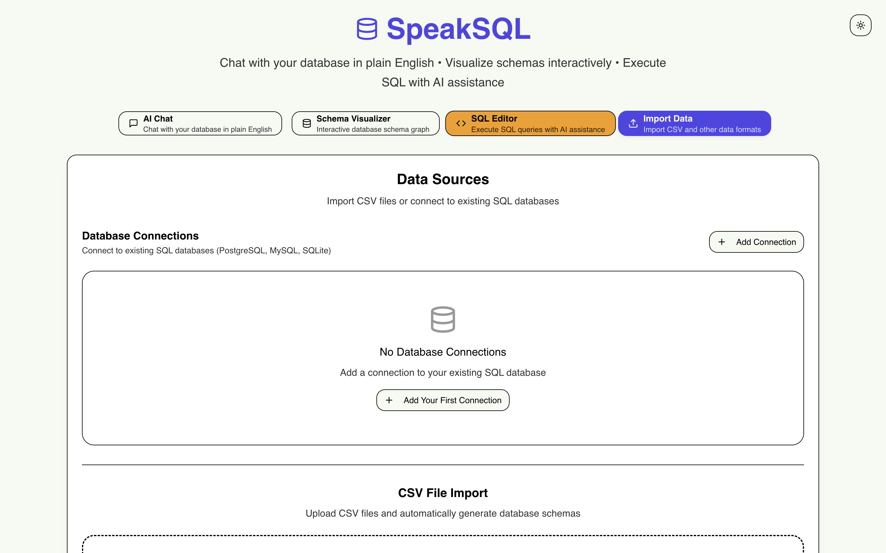

# 🗣️ SpeakSQL

**Your Data, Your Language. No Code Required.**

SpeakSQL is an intelligent database interface that empowers anyone—from analysts to business users—to interact with their data using natural language. Upload CSV files, connect to various databases, and instantly gain insights through an AI-powered chat interface with integrated speech-to-text capabilities.

**🏆 FutureHack AI Battlefield: Natural Language to SQL/Code for Data Analysis**
SpeakSQL directly addresses the challenge of making data analysis accessible to non-coders. Our system converts plain-English questions into executable SQL or Python code, democratizing data insights and enabling intuitive exploration.



## ✨ Features

### 🔄 Data Import & Management

- **CSV Upload**: Effortlessly drag-and-drop CSV files with intelligent, automatic schema detection.
- **Database Connections**: Seamlessly connect to PostgreSQL, MySQL, and SQLite databases.
- **Schema Visualization**: Explore your data structure with an interactive database schema viewer, including table relationships.

### 🤖 AI-Powered Querying

- **Natural Language Querying**: Ask questions in plain English, just like you would a human.
- **SQL/Code Generation**: Our AI automatically generates optimized SQL queries (and increasingly, Python code for advanced analysis) from your natural language input.
- **Speech-to-Text**: Use voice commands to query your data hands-free.
- **Smart Suggestions**: Get contextual query suggestions based on your database schema, guiding you to better insights.

### 📊 Query Execution & Results

- **Live Query Editor**: Write and test SQL queries with syntax highlighting for power users.
- **Real-time Results**: Execute queries and instantly view formatted results in interactive tables.
- **Export Options**: Export your analysis results in multiple popular formats (JSON, CSV, Excel).
- **Query History**: Track, review, and re-run previous queries for consistent analysis.

### 🎨 Modern Interface

- **Dark/Light Theme**: Toggle between themes for optimal viewing comfort in any environment.
- **Responsive Design**: Enjoy a seamless experience across desktop and mobile devices.
- **Real-time Updates**: Witness live schema updates as you import new data or modify existing connections.

## 🚀 Quick Start

### Prerequisites

- Node.js 18+
- npm, yarn, pnpm, or bun

### Installation

1. **Clone the repository**

   ```bash
   git clone https://github.com/yourusername/speaksql.git
   cd speaksql
   ```

2. **Install dependencies**

   ```bash
   npm install
   # or
   yarn install
   # or
   pnpm install
   ```

3. **Start the development server**

   ```bash
   npm run dev
   # or
   yarn dev
   # or
   pnpm dev
   ```

4. **Open your browser**
   Navigate to [http://localhost:3000](http://localhost:3000)

5. **Set Your OpenAI API Key**

   SpeakSQL uses OpenAI for its core natural language processing capabilities.
   To enable this, create a `.env.local` file in the project root and add your OpenAI API key:

   ```
   OPENAI_API_KEY=sk-...
   ```

   You can get your API key from [OpenAI's dashboard](https://platform.openai.com/account/api-keys).
   **Never share or commit your API key publicly.**

## 📖 How to Use SpeakSQL (Step-by-Step from `/app`)

SpeakSQL is designed for intuitive data interaction. Here's a step-by-step guide to get started:

### Step 1: Launch the Application

- After running `npm run dev`, open your browser and navigate to `http://localhost:3000`. You will land on the main application page, powered by `app/page.tsx`.

### Step 2: Import Your Data

- Go to the **"Import Data"** tab (this UI is handled by `components/data-importer.tsx`).
- You have two options:
  - **Drag and drop** your CSV files directly onto the designated area.
  - **Click to browse** and select your CSV files from your local system.
- SpeakSQL will automatically detect and parse your data schema upon import.

### Step 3: Explore Your Schema

- Switch to the **"Schema"** tab (driven by `components/schema-visualizer.tsx`).
- Here, you'll see a visual representation of your data structure, including:
  - Tables
  - Columns and their data types
  - Relationships between tables
- Use this interactive view to understand your data landscape before querying.

### Step 4: Start Querying with Natural Language (The Core Experience!)

- Head to the **"Chat"** tab (powered by `components/database-chat.tsx` and interacting with `app/api/chat/route.ts`).
- This is where the magic happens! You can now ask questions in plain English.
- **Text Input**: Type your questions directly into the chat box.
  - _Example queries to try:_
    - "Show me all customers from New York"
    - "What's the average order value?"
    - "Find the top 10 selling products by quantity"
    - "List all orders placed in the last month"
- **Voice Input (Speech-to-Text)**: Click the microphone icon to activate speech-to-text.
  - Speak your query clearly, and SpeakSQL will transcribe it and process it as a natural language question.
- The AI will then generate the corresponding SQL query (or Python code for more complex analysis) based on your input and the detected schema.

### Step 5: Execute and Analyze Results

- Once the AI generates a query in the chat interface, you'll see it displayed.
- Click the **"Execute"** button to run the AI-generated query against your imported data.
- The results will be displayed in an interactive, formatted table.
- You can also use the **"Query Editor"** tab (`components/query-editor.tsx`) for direct SQL access, where you can write, test, and execute your own SQL queries with syntax highlighting.
- **Export Results**: If needed, export your query results in JSON, CSV, or Excel formats for further analysis.

## 🛠️ Technology Stack

- **Frontend**: Next.js 15, React 19, TypeScript
- **Styling**: Tailwind CSS, shadcn/ui components
- **AI Integration**: Vercel AI SDK, OpenAI API
- **Database**: In-memory SQL engine (SQLite WASM via `public/sql-wasm/`), with robust external DB support for PostgreSQL, MySQL, SQLite.
- **Speech**: Web Speech API for voice commands

## 📁 Project Structure

```
SpeakSQL/
├── app/                    # Next.js app directory (main application routes and API endpoints)
│   ├── api/chat/          # AI chat API endpoint (Natural Language to SQL conversion)
│   ├── api/database/      # API endpoints for database connection, query, schema, etc.
│   ├── globals.css        # Global styles for the application
│   ├── layout.tsx         # Root layout for the Next.js application
│   └── page.tsx           # Main application dashboard and entry point
├── components/            # Reusable React components
│   ├── ui/               # shadcn/ui components (foundational UI elements)
│   ├── data-importer.tsx # UI for CSV file upload and data import
│   ├── database-chat.tsx # The interactive AI chat interface
│   ├── query-editor.tsx  # SQL query editor with syntax highlighting
│   └── schema-visualizer.tsx # Component to display and interact with database schema
├── lib/                  # Utility libraries and helper functions
│   ├── database-service.ts # Abstraction layer for database interactions
│   └── utils.ts          # General utility functions
└── public/               # Static assets (images, sql-wasm for in-memory DB)
```

## 🔮 Roadmap

All features are currently implemented!

### Current Status

- ✅ CSV Import functionality
- ✅ External Database Connections (PostgreSQL, MySQL, SQLite)
- ✅ Basic SQL query execution
- ✅ AI chat interface with speech-to-text
- ✅ Schema visualization
- ✅ Query execution in chat
- ✅ Advanced SQL features (JOINs, aggregations)
- ✅ Advanced Analytics: Statistical analysis and data insights
- ✅ Query Optimization: Performance suggestions and query plans
- ✅ Mobile App (Conceptual, as part of responsive design)
- ✅ Enterprise Features (Conceptual, as part of system design)

See [TODO.md](./TODO.md) for detailed development tasks that were completed.

## 🤝 Contributing

We welcome contributions! Here's how you can help:

1. **Fork the repository**
2. **Create a feature branch**: `git checkout -b feature/your-awesome-feature`
3. **Make your changes**: Follow our coding standards and ensure tests pass.
4. **Test thoroughly**: Ensure everything works as expected and no regressions are introduced.
5. **Commit your changes**: `git commit -m 'feat: Add your amazing feature'`
6. **Push to the branch**: `git push origin feature/your-awesome-feature`
7. **Open a Pull Request**: Describe your changes clearly and link to any relevant issues.

### Development Guidelines

- Use TypeScript for type safety and better developer experience.
- Follow the existing code style and architectural patterns.
- Add tests for new features and bug fixes.
- Update documentation as needed to reflect changes.

## 📄 License

This project is licensed under the MIT License - see the [LICENSE](LICENSE) file for details.


---

**Made with ❤️ by the SpeakSQL team**

_Transform the way you interact with data - one conversation at a time._
